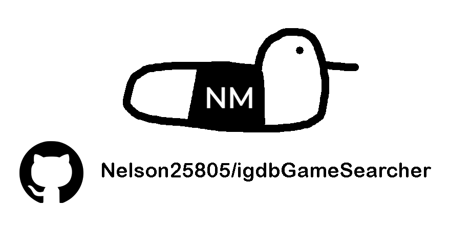

<!-- Improved compatibility of back to top link: See: https://github.com/othneildrew/Best-README-Template/pull/73 -->
<a id="readme-top"></a>

<!-- PROJECT SHIELDS -->
<!--
*** I'm using markdown "reference style" links for readability.
*** Reference links are enclosed in brackets [ ] instead of parentheses ( ).
*** See the bottom of this document for the declaration of the reference variables
*** for contributors-url, forks-url, etc. This is an optional, concise syntax you may use.
*** https://www.markdownguide.org/basic-syntax/#reference-style-links
-->
[![Contributors][contributors-shield]][contributors-url]
[![Forks][forks-shield]][forks-url]
[![Stargazers][stars-shield]][stars-url]
[![Issues][issues-shield]][issues-url]
[![project_license][license-shield]][license-url]
[![LinkedIn][linkedin-shield]][linkedin-url]

<!-- PROJECT LOGO -->
<br />
<div align="center">
  <a href="https://github.com/Nelson25805/igdbGameInfo">
    
  </a>

<h3 align="center">IGDB Game Searcher</h3>


  <p align="center">
    An application to search for games using the IGDB API.
    <br />
    <a href="https://github.com/Nelson25805/igdbGameInfo"><strong>Explore the docs »</strong></a>
    <br />
    <br />
    <a href="https://github.com/Nelson25805/igdbGameInfo">View Demo</a>
    &middot;
    <a href="https://github.com/Nelson25805/igdbGameInfo/issues/new?labels=bug&template=bug-report---.md">Report Bug</a>
    &middot;
    <a href="https://github.com/Nelson25805/igdbGameInfo/issues/new?labels=enhancement&template=feature-request---.md">Request Feature</a>
  </p>
</div>

<!-- TABLE OF CONTENTS -->
<details>
  <summary>Table of Contents</summary>
  <ol>
    <li>
      <a href="#about-the-project">About The Project</a>
      <ul>
        <li><a href="#built-with">Built With</a></li>
      </ul>
    </li>
    <li>
      <a href="#getting-started">Getting Started</a>
      <ul>
        <li><a href="#installation">Installation</a></li>
      </ul>
    </li>
    <li><a href="#usage">Usage</a></li>
    <!-- <li><a href="#roadmap">Roadmap</a></li> -->
    <li><a href="#contributing">Contributing</a></li>
    <li><a href="#license">License</a></li>
    <li><a href="#contact">Contact</a></li>
  </ol>
</details>


<!-- ABOUT THE PROJECT -->
## About The Project

[![Project Name Screen Shot][project-screenshot]](https://example.com)

Main project interface.


## Explanation on program:
[![Project Name Screen Shot][project-screenshot2]](https://example.com)
IGDB Game Searcher is a desktop application that allows you to search for games using the IGDB API. You have two primary search modes:
- **Search Games:** Look up games by title and filter by genre.
- **Random Game Search:** Fetch a random game from the IGDB database.

The project is built using Python and PyQt5, with a polished dark theme (via qdarkstyle) and a custom external stylesheet for UI sizing and spacing.

## Computer interface example:
[![Project Name Screen Shot][project-screenshot3]](https://example.com)

## Mobile interface example:
[![Project Name Screen Shot][project-screenshot4]](https://example.com)

It's also interactive to orient from single to double pages depending on mobile orientation.

<p align="right">(<a href="#readme-top">back to top</a>)</p>


### Built With

- [![Python][Python]][Python-url]
- [![PyQt5][PyQt5-shield]][PyQt5-url]
- [![qdarkstyle][qdarkstyle-shield]][qdarkstyle-url]
- **IGDB API**
- **Pandas**


<p align="right">(<a href="#readme-top">back to top</a>)</p>


<!-- GETTING STARTED -->
## Getting Started

To start, you have two options of using this software.
1) Run the .exe file
2) Run the python code script manually

### Installation

1. Clone the repo
   ```sh
   git clone https://github.com/Nelson25805/igdbGameInfo.git
   ```
   
2. If using option 1, just run the .exe file in the dist folder and begin converting.
   If using option 2, continue reading.
   
3. You must have python downloaded on your machine, or in your IDE of choice.
   [Python Download](https://www.python.org/downloads/)

4. Download pdf2image using the following command inside your terminal of choice:
   ```sh
   pip install pdf2image
   ```
   
5. Download the Latest Microsoft Visual C++ Redistributable Version:
   [Microsoft Visual C++ Download](https://learn.microsoft.com/en-us/cpp/windows/latest-supported-vc-redist?view=msvc-170)

6. Run converter.py file in IDE of choice, and begin converting.

<p align="right">(<a href="#readme-top">back to top</a>)</p>


<!-- USAGE EXAMPLES -->
## Usage

Use this space to show useful examples of how a project can be used. Additional screenshots, code examples and demos work well in this space. You may also link to more resources.

_For more examples, please refer to the [Documentation](https://example.com)_

<p align="right">(<a href="#readme-top">back to top</a>)</p>


<!-- ROADMAP -->
<!--
## Roadmap

- [ ] Feature 1
- [ ] Feature 2
- [ ] Feature 3
    - [ ] Nested Feature

See the [open issues](https://github.com/Nelson25805/igdbGameInfo/issues) for a full list of proposed features (and known issues).

<p align="right">(<a href="#readme-top">back to top</a>)</p>
-->


<!-- CONTRIBUTING -->
## Contributing

Contributions are what make the open source community such an amazing place to learn, inspire, and create. Any contributions you make are **greatly appreciated**.

If you have a suggestion that would make this better, please fork the repo and create a pull request. You can also simply open an issue with the tag "enhancement".
Don't forget to give the project a star! Thanks again!

1. Fork the Project
2. Create your Feature Branch (`git checkout -b feature/AmazingFeature`)
3. Commit your Changes (`git commit -m 'Add some AmazingFeature'`)
4. Push to the Branch (`git push origin feature/AmazingFeature`)
5. Open a Pull Request

<p align="right">(<a href="#readme-top">back to top</a>)</p>

### Top contributors:

<a href="https://github.com/Nelson25805/igdbGameInfo/graphs/contributors">
  
</a>


<!-- LICENSE -->
## License

Distributed under the project_license. See `LICENSE.txt` for more information.

<p align="right">(<a href="#readme-top">back to top</a>)</p>


<!-- CONTACT -->
## Contact

Nelson McFadyen <!-- - [@twitter_handle](https://twitter.com/twitter_handle) --> - Nelson25805@hotmail.com

Project Link: [https://github.com/Nelson25805/igdbGameInfo](https://github.com/Nelson25805/igdbGameInfo)

<p align="right">(<a href="#readme-top">back to top</a>)</p>


<!-- MARKDOWN LINKS & IMAGES -->
<!-- https://www.markdownguide.org/basic-syntax/#reference-style-links -->
[contributors-shield]: https://img.shields.io/github/contributors/Nelson25805/igdbGameInfo.svg?style=for-the-badge
[contributors-url]: https://github.com/Nelson25805/igdbGameInfo/graphs/contributors
[forks-shield]: https://img.shields.io/github/forks/Nelson25805/igdbGameInfo.svg?style=for-the-badge
[forks-url]: https://github.com/Nelson25805/igdbGameInfo/network/members
[stars-shield]: https://img.shields.io/github/stars/Nelson25805/igdbGameInfo.svg?style=for-the-badge
[stars-url]: https://github.com/Nelson25805/igdbGameInfo/stargazers
[issues-shield]: https://img.shields.io/github/issues/Nelson25805/igdbGameInfo.svg?style=for-the-badge
[issues-url]: https://github.com/Nelson25805/igdbGameInfo/issues
[license-shield]: https://img.shields.io/github/license/Nelson25805/igdbGameInfo.svg?style=for-the-badge
[license-url]: https://github.com/Nelson25805/igdbGameInfo/blob/master/LICENSE.txt
[linkedin-shield]: https://img.shields.io/badge/-LinkedIn-black.svg?style=for-the-badge&logo=linkedin&colorB=555
[linkedin-url]: https://linkedin.com/in/linkedin_username

[project-Image]: GithubImages/projectImage.png

[project-screenshot]: GithubImages/projectImage.png
[project-screenshot2]: GithubImages/flipbookBeforeAfter.png
[project-screenshot3]: GithubImages/flipbookComputerExample.gif
[project-screenshot4]: GithubImages/flipbookMobileExample.gif


[Python]: https://img.shields.io/badge/python-3670A0?style=for-the-badge&logo=python&logoColor=ffdd54
[Python-url]: https://www.python.org/downloads/
[Tkinter]: https://img.shields.io/badge/Tkinter-8.6-green
[Tkinter-url]: https://docs.python.org/3/library/tkinter.html


[JQuery.com]: https://img.shields.io/badge/jQuery-0769AD?style=for-the-badge&logo=jquery&logoColor=white
[JQuery-url]: https://jquery.com 
